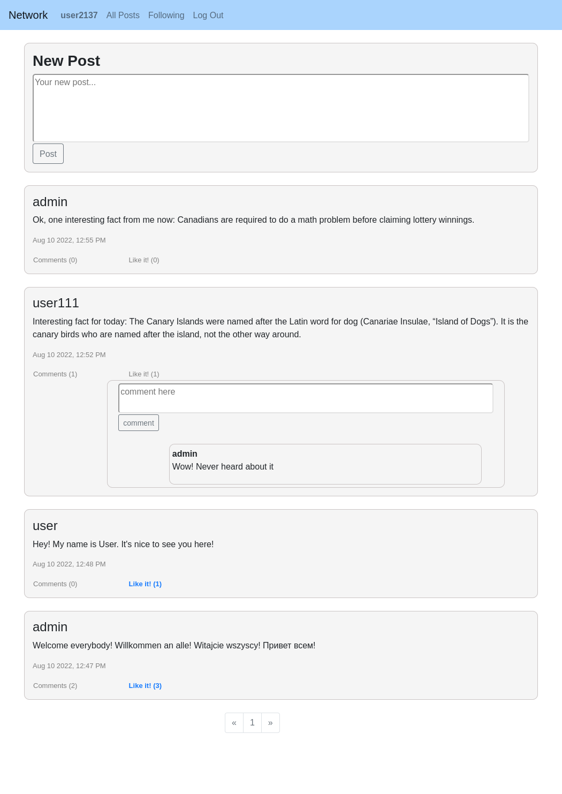
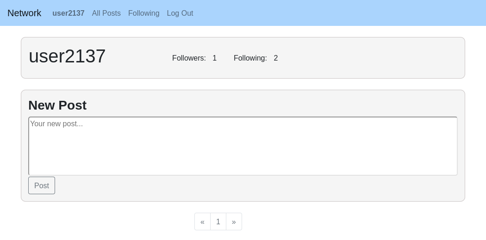

# CS50-Network
An twitter like social network web application prepared as a project for [CS50 Web Development online course.](https://cs50.harvard.edu/web/2020/) The project contains several services

## view all posts (together with comments and likes)

## see profile

## others
User can also add comments and likes, edit and delete them, follow other users, edit or delete her/his own posts, browse posts of all users or only followed ones